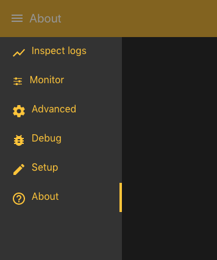
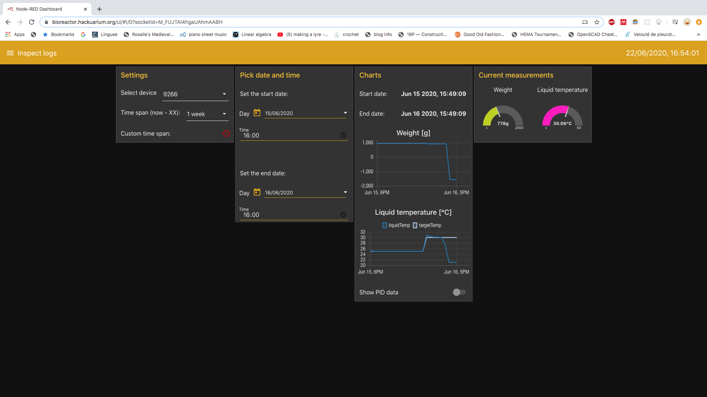
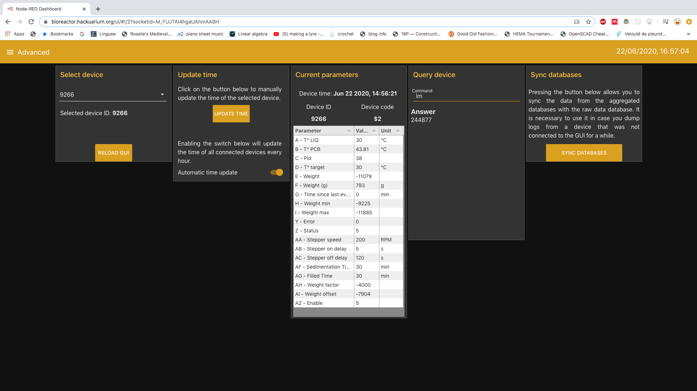
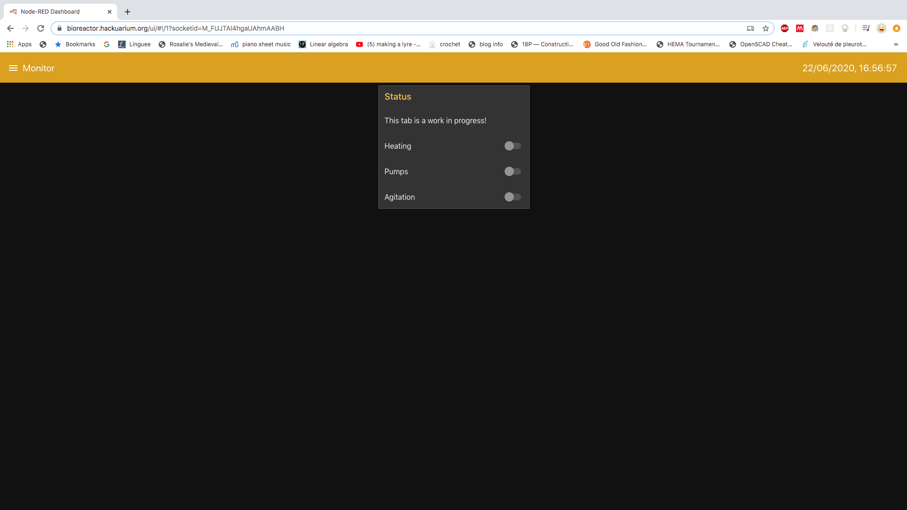
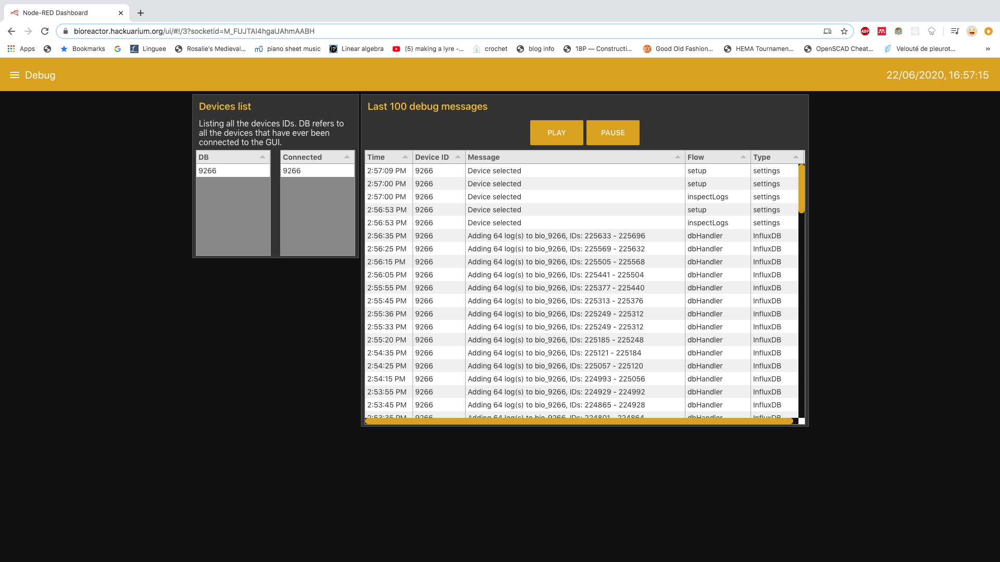
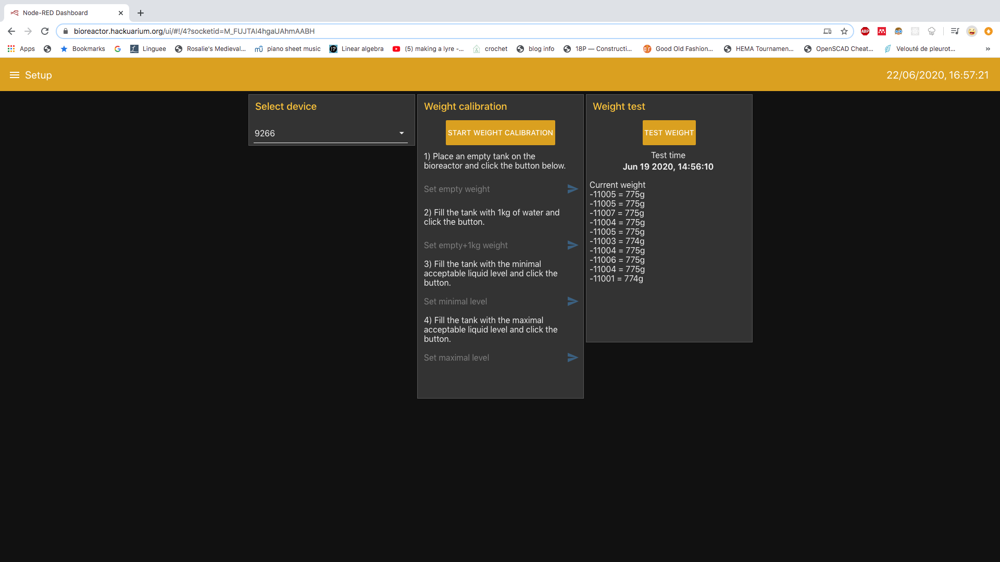

# Bioreactors GUI user-guide

[Home](../../../README.md) | [Bioreactor TOC](../../bioreactor.md)

This doc was written on the 2020.06.16, and the interface may have changed significantly since then.

## YouTube videos

Two videos explaining how the user interface works have been produced:

- [Node-Red Bioreactors GUI: The dashboard](https://youtu.be/qgBxLSVTjM8)
- [Node-Red Bioreactors GUI: The developer side](https://youtu.be/raDn0GiZ2hM)

## General

The main menu can be accessed using the button in the top-left corner. Clicking the button displays a sidebar menu with a list of all the available tabs. The current local time is displayed in the top-right corner.

The GUI of the bioreactors is composed of the tabs:

- _Inspect logs_
- _Advanced_
- _Monitor_
- _Debug_
- _Setup_
- _About_

## Inspect logs

The _Inspect logs_ tab allows to visualize the logs stored in the database. The user should first select the device to inspect. Charts that display the liquid temperature and the weight of the corresponding device are shown.

They are two options to set the time scale of the charts. The user can either pick one of the limited options of a dropdown menu ("Current data" mode) or select a start and end date ("Past data" mode). The mode can be changed using the "Custom time span" button. The start and end dates of the data displayed in the charts is indicated just over these.

The current weight and temperature of the selected bioreactor are also displayed in gauges.

## Advanced

This is likely the most complex tab of this interface. The _Advanced_ tab allows you to select one of the serial devices that has been identified as a bioreactor.

Just underneath the dropdown to select the device, there is a button that allows to reload the GUI. This has been implemented because reloading can help with some issues. Yet, the address bar is not accessible on the Raspberry Pi touchscreen when Chromium is in kiosk mode.

Once the device is selected, you can see its current settings (commonly accessed with the serial command `ll`). This information is updated every second. Additionally, you can send any serial command using the "Query device" group, as you would from the Arduino IDE serial monitor.

Another feature on this tab is the "Update time" group. It allows you either to manually update the time of all the connected devices, or to enable an automatic update, that will occur every 10 minutes.

Finally, the "Sync databases" group is a fairly complex feature. If the button is clicked, all the raw logs from the devices will be aggregated into three other databases (aggregating by minute, hour and day). This feature is only useful when a device that has been working autonomously for some time is connected to the interface. Then, all the data it has acquired is dumped at once and the aggregation has to be executed manually through the button. Otherwise, the new data will be aggregated automatically using continuous queries.

## Monitor

The _Monitor_ tab groups all the features that allow to change the bioreactors parameters easily. For example, the user can enable or disable food, pid and temperature.

This tab is still a work in progress in June 2020.

## Debug

This tab contains two groups.

The first group is a table that displays the IDs of all the devices that have ever been connected to the GUI as well as all the devices that are currently connected.

The other group shows the last 100 debug messages saved in the database. It can be used to know what the GUI has done at what point in time.

## Setup

The _Setup_ tab allows to setup all the devices. It basically brings together tools that allow you to calibrate your bioreactors. This is a step that you should do every time you connect a bright new device to the GUI.

For now, only weight calibration is available on this tab. To calibrate the weight, the user first has to select the proper device. Then, he can follow the instructions of the "Weight calibration" group. Finally, the weight should be tested with the "Weight test" group.

