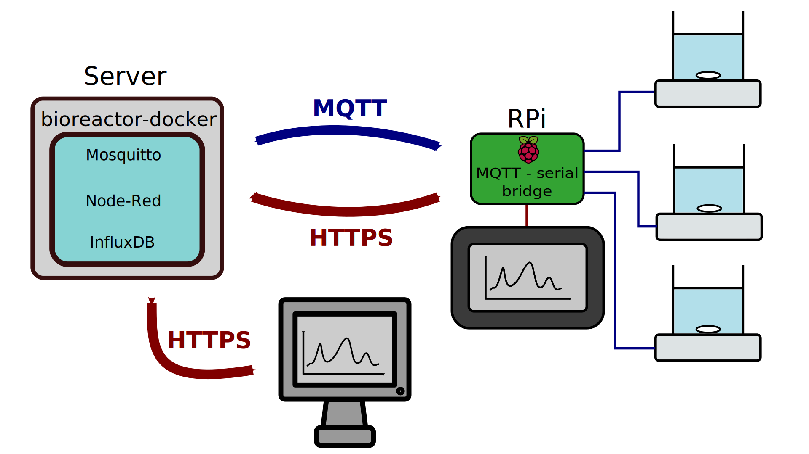

# Bioreactors setup overview

[Home](../../../README.md) | [Bioreactor TOC](../../bioreactor.md)

## The different components

### Bioreactors

Each [bioreactor](https://github.com/Hackuarium/bioreactor) is powered using a 12V power supply. It can run independently from any computer and can store 15 days of logs. The bioreactor logs 26 parameters in its flash memory, which is non-volatile. The logs format is a string of 136 hexadecimal symbols, which we call a "compact log". Each bioreactor has a unique ID that must be attributed to it when doing the setup. The ID is composed of two characters. The first one, which specifies the device kind, must be a "\$".

### Serial to MQTT bridge

One or many bioreactors are connected to a computer with USB cables. The computer runs [a script](https://github.com/Hackuarium/serial-mqtt-brigde) that acts as a serial to MQTT bridge. This means that when an MQTT "query" message is received, the computer sends a serial command to the appropriate bioreactors in order to get the answer. Then, the data is sent over as an MQTT message.

In our case, the computer is a Raspberry Pi with a 7 inch touchscreen. The touchscreen displays the GUI for the control of the bioreactors.

### MQTT broker

Between the bridge and the GUI, an MQTT broker must run in order to handle all the messages.

### GUI

Finally, the GUI can run in a completely different place as where the bioreactors are. The GUI consists of an instance of Node-Red. It contains an MQTT publisher and an MQTT subscriber. Regularly, the GUI sends messages asking for the last logs of each bioreactor. These logs are then parsed using the [legoino-utils](https://github.com/Hackuarium/legoino-util) project.

The node-red dashboard allows the user to see all the stored data in gauges, charts and tables. Moreover, the user can send commands to every bioreactor on the network, in order to inspect and debug.

### Database

All the data that comes from the user interface has to be stored in a database. We are using InfluxDB.

## Possible setups

They are currently two possibilities on how to connect all the components that we just presented.

We have developed a docker project called [`bioreactor-docker`](https://github.com/Hackuarium/bioreactor-docker) which brings together the Node-Red instance, an InfluxDB database and a Mosquitto broker.

### Setup 1

In the first setup, the `bioreactor-docker` project is deployed on a server and the Raspberry Pi is running the serial to MQTT bridge. The bioreactors are connected to the Raspberry Pi using mini USB cables. The node-red instance on the server sends MQTT queries to the Raspberry, which forwards them to the bioreactors through serial. The answers are sent again as MQTT messages. Node-Red parses the answers and stores the data in the InfluxDB image. The Raspberry Pi queries fetches the graphical interface from the server through HTTPS and displays it on its touchscreen. Other monitors can also access the graphical interface to control the bioreactors remotely.

In this setup, many raspberry pi's with the MQTT-serial bridge can communicate simultaneously with the server. Additionally, accessing the graphical interface from anywhere in the world is possible, because the only information that goes from the Raspberry Pi to the server is over MQTT.

### Setup 2

The main (and only) difference between this setup and the first one is that the `bioreactor-docker` project is deployed directly on the Raspberry Pi. This implies that all the database is stored on the SD card of the Raspberry, which is not the safest. Also, the memory might be full a lot faster.

The advantage of this method is that from any computer inside the LAN on which the Raspberry Pi is, you can access the graphical interface directly. However, accessing it from elsewhere becomes really difficult, since the Raspberry Pi would have to be accessible from the cloud (this is not trivial inside of a university).

### Setup 3: To consider

To have the advantages of the two methods above without the drawbacks, we thought about redesigning the serial-MQTT bridge in order for it to handle many MQTT brokers.

Then, we could have the `bioreactor-docker` project deployed simultaneously on a server accessible from the cloud, and on the Raspberry Pi. This would also be more secure from the data persistence point of view, since all the data will be copied twice.
