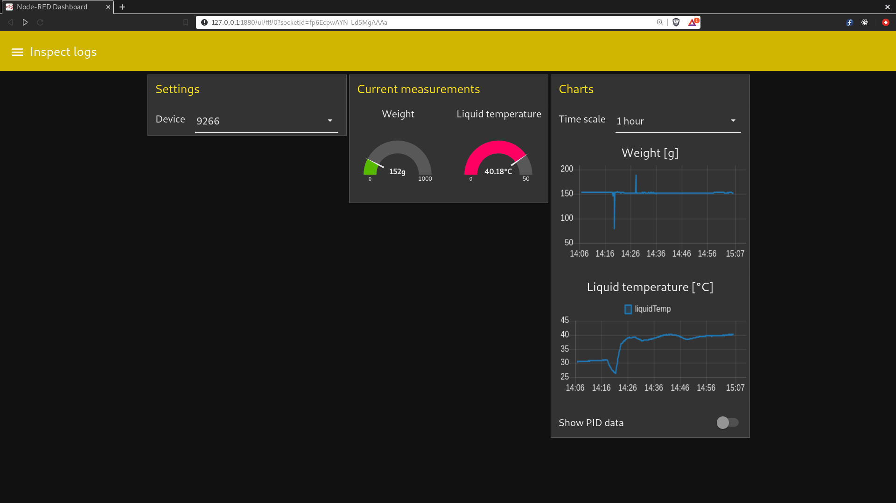

# `opatiny/nodered-bioreactor-gui`

[Home](../../README.md) | [Projects TOC](../projects.md)

Link: [https://github.com/opatiny/nodered-bioreactor-gui](https://github.com/opatiny/nodered-bioreactor-gui)

## Goal

Work on the bioreactors GUI using node-red.

## Context

Building a functional and practical user interface to manage the bioreactors is one of the main goal of my internship. We use node-red to build it in order to make it easier for people with little programming experience to modify the GUI according to their needs.

## Database structure

We want to store the parsed logs in an InfluxDB database called `bioreactors`. Each bioreactor should have its own measurement called `bio_<bioreactorID>`.

Two other databases contain data aggregated by hours and day. They are called `bioreactors_hour` and `bioreactors_day`.

Warning: The field name "weightSinceLast" is a typo mistake! It should have been "waitSinceLast".

### Continuous queries

Each `bio_<bioreactorID>` measurement should be queried by two continuous queries. One of them should aggregate the data by hour (`bioreactors_hour`) whereas the other one should aggregate it by day (`bioreactors_day`). The measurement names should be the same as in `bioreactors`.

The functions to aggregate the fields should be the following:

- `eventId`: count number of distinct entries
- `status`: `min()`
- `error`: `max()`
- all other fields: `median()`

To solve this problem, we use what is called "back-references".

#### Minute aggregation db

```sql
CREATE CONTINUOUS QUERY bio_minute_cq ON bioreactors
BEGIN
  SELECT max(error) AS max_error, count(distinct(eventId)) AS count_distinct_eventId, median(grWeight) AS median_grWeight, median(id) AS median_id, median(liquidTemp) as median_liquidTemp, median(maxWeight) AS median_maxWeight, median(minWeight) AS median_minWeight, median(pcbTemp) AS median_pcbTemp, median(pidTemp) AS median_pidTemp, min(status) AS min_status, median(targetTemp) AS median_targetTemp, median(weight) AS median_weight, median(weightSinceLast) AS median_weightSinceLast
  INTO bioreactors_minute.autogen.:MEASUREMENT
  FROM bioreactors.autogen./.*/
END
```

#### Hour aggregation db

```sql
CREATE CONTINUOUS QUERY bio_hour_cq ON bioreactors
BEGIN
  SELECT max(error) AS max_error, count(distinct(eventId)) AS count_distinct_eventId, median(grWeight) AS median_grWeight, median(id) AS median_id, median(liquidTemp) as median_liquidTemp, median(maxWeight) AS median_maxWeight, median(minWeight) AS median_minWeight, median(pcbTemp) AS median_pcbTemp, median(pidTemp) AS median_pidTemp, min(status) AS min_status, median(targetTemp) AS median_targetTemp, median(weight) AS median_weight, median(weightSinceLast) AS median_weightSinceLast
  INTO bioreactors_hour.autogen.:MEASUREMENT
  FROM bioreactors.autogen./.*/
  GROUP BY time(1h), *
END
```

#### Day aggregation db

```sql
CREATE CONTINUOUS QUERY bio_day_cq ON bioreactors
BEGIN
  SELECT max(error) AS max_error, count(distinct(eventId)) AS count_distinct_eventId, median(grWeight) AS median_grWeight, median(id) AS median_id, median(liquidTemp) as median_liquidTemp, median(maxWeight) AS median_maxWeight, median(minWeight) AS median_minWeight, median(pcbTemp) AS median_pcbTemp, median(pidTemp) AS median_pidTemp, min(status) AS min_status, median(targetTemp) AS median_targetTemp, median(weight) AS median_weight, median(weightSinceLast) AS median_weightSinceLast
  INTO bioreactors_day.autogen.:MEASUREMENT
  FROM bioreactors.autogen./.*/
  GROUP BY time(1d), *
END
```

### Overview

InfluxDB will contain four databases:

- `bioreactors`: "raw" logs
- `bioreactors_minute`: logs aggregated by minute (CQ on `bioreactors`)
- `bioreactors_hour`: logs aggregated by hour (CQ on `bioreactors`)
- `bioreactors_day`: logs aggregated by day (CQ on `bioreactors`)

The measurements in these databases have the format `bio_<bioreactorID>`.

## Serial commands

The useful serial commands of the bioreactor are:

- `lm`: to get the multilogs, follow it with a number that indicate from which log id you want to retrieve the data
- `uc`: to retrieve the current settings
- `o`: one-wire info -> allows to debug the temperature probe

## Debug system

We developed a system that allows the user to inspect the last 100 debug messages of the GUI. The debug messages are set using `msg.debug` and the `debug` subflow.

The input `msg.debug` object should have properties:

- `id`: the device id
- `type`: the message type
- `message`: the debug message

## Packages used

- `legoino-util`: to parse the logs (installed as a global variable in settings.js)
- influxdb
- gate
- dashboard

**Comment:** MQTT nodes are built in the basic install.

## Results

The GUI is composed of two tabs: _Advanced_ and _Inspect logs_.

The _Advanced_ tab allows you to select one of the serial devices that has been identified as a bioreactor. Once the device is selected, you can see its current settings. This information is updated every second. Additionally, you can send any serial command, as you would from the Arduino IDE serial monitor.

On the other hand, the _Inspect logs_ tab allows you to see the logs stored in the database.Charts that display the liquid temperature and the weight are shown. The user can set the time spans using a dropdown menu.



