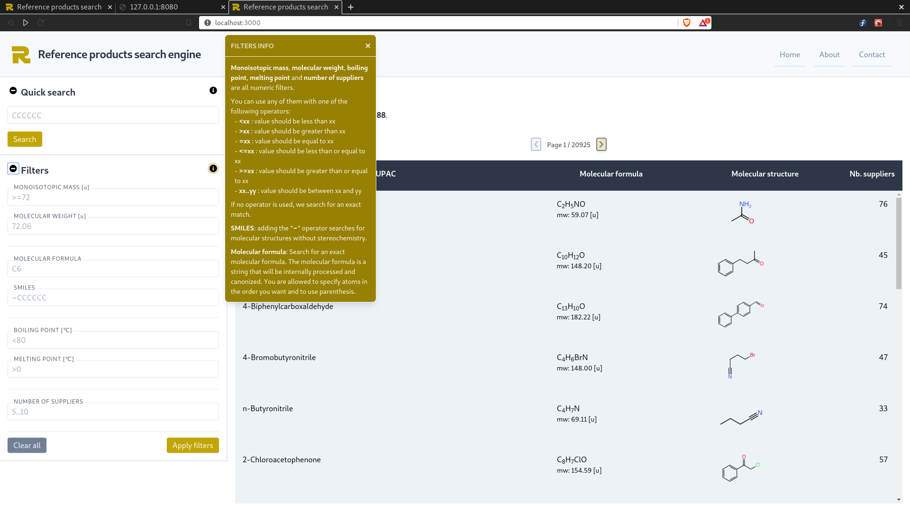
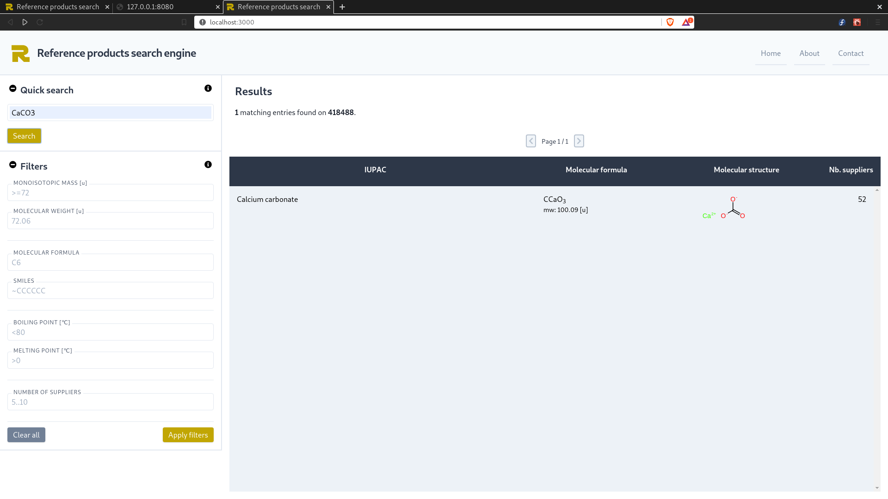

# chemexper/reference-database-front-end

[Home](../../README.md) | [Projects TOC](../projects.md)

Link (private repo): [https://github.com/cheminfo/reference-database-front-end](https://github.com/cheminfo/reference-database-front-end)

## Goal
Make the front-end for [reference-database](./reference-database.md). This project will consist of a responsive web app using React.js and Tailwind CSS. There will be a sidebar with various input fields which allow to filter the database. The filters are passed as javascript variables to a function that uses the GET protocol to query the database. The results are shown in a table.

## Packages used

- `tailwind-css`: allows to make good-looking GUI with easy to reuse CSS
- `@fortawesome/fontawesome-free`: for svg icons
- `react-bootstrap`: popovers -> didn't use this in the end because it influenced the whole style off the app
- `popper`: for popovers
- `react-mf`: to format molecular formulas
- `react-ocl`: render of molecular structures

## To show in the results

We want to show the following fields in the results:
- IUPAC name
- Formatted molecular formula and molecular weight
- An svg image of the molecular structure
- Only if the screen is big enough: the number of suppliers

## Results

General layout and info popup.

  

Quick search for chalk using molecular formula CaCO3.

## Links

- formik form: [https://github.com/cheminfo/chemcalc-react/blob/master/src/component/MFFinder/MFFinder.js#L106-L221](https://github.com/cheminfo/chemcalc-react/blob/master/src/component/MFFinder/MFFinder.js#L106-L221)
- react table: [https://github.com/cheminfo/chemcalc-react/blob/master/src/component/BioProducts/BioProductsTable.js](https://github.com/cheminfo/chemcalc-react/blob/master/src/component/BioProducts/BioProductsTable.js)
- tutorial react app with tailwind: [https://www.smashingmagazine.com/2020/02/tailwindcss-react-project/](https://www.smashingmagazine.com/2020/02/tailwindcss-react-project/)
- tutorial react and tailwind 2: [https://medium.com/clocktwine/creating-a-simple-website-using-react-tailwind-css-postcss-6bbc419ded0c](https://medium.com/clocktwine/creating-a-simple-website-using-react-tailwind-css-postcss-6bbc419ded0c)
- generate color palettes: [https://www.w3schools.com/colors/colors_picker.asp](https://www.w3schools.com/colors/colors_picker.asp)
- tailwind sidebar template: [https://tailwindcomponents.com/component/sidenav](https://tailwindcomponents.com/component/sidenav)
- tailwind form template: [https://tailwindcomponents.com/component/simple-form-field](https://tailwindcomponents.com/component/simple-form-field)
- tailwind popup window: [https://www.creative-tim.com/learning-lab/tailwind-starter-kit/documentation/react/tooltips/right](https://www.creative-tim.com/learning-lab/tailwind-starter-kit/documentation/react/tooltips/right)