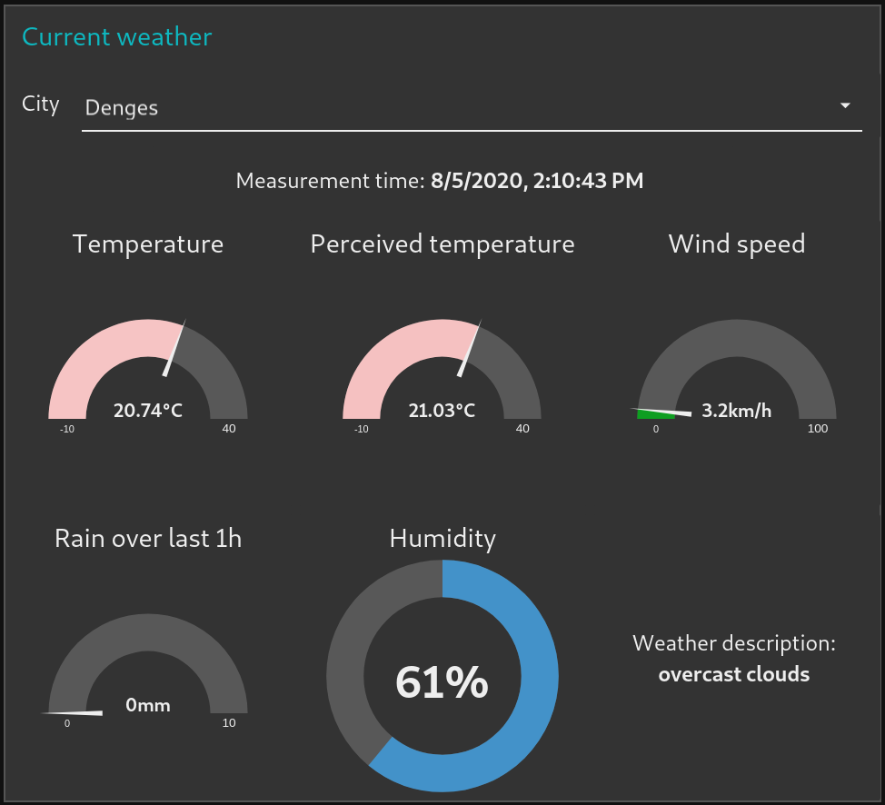

# Historical weather dashboard

Link: [https://github.com/opatiny/historical-weather-dashboard](https://github.com/opatiny/historical-weather-dashboard)

## Goal

Use **node-red** to store the weather data of 4 cities in an InfluxDB database and show it in a dashboard.

## Database structure

Node-red package for InfluxDB: `node-red-contrib-influxdb`

We create an InfluxDB database called `weather_db`. The database should contain one measurement called `weather`.

The measurement contains fields and tags.

### Fields

- `temp`: Temperature in [°C]
- `tempFeel`: Temperature in [°C] as perceived by humans
- `humidity`: Humidity in [%]
- `wind`: Wind speed in [m/s]
- `rain`: Amount of rain fallen over last hour in [mm]
- `clouds`: Cloudiness in [%] (I forgot about this one...)
- `weather`: Weather description in a few words

### Tags

- `city`: Location of the measurement

### Continuous queries

3 different measurements:
- `weather`: log data in the measurement every minute
- `weather_hourly`: query `weather` and aggregate by hour
- `weather_daily`: query `weather` and aggregate by day

What I initially thought about (retention policy):
- for data >24h, keep 1 entry per hour

### `weather_hourly` continuous query

```sql
CREATE CONTINUOUS QUERY weather_hourly_cq ON weather_db 
BEGIN 
  SELECT mean(humidity) AS humidity, mean(rain) AS rain, mean(temp) AS temp, mean(tempFeel) AS tempFeel, mean(wind) AS wind 
  INTO weather_db.autogen.weather_hourly 
  FROM weather_db.autogen.weather 
  GROUP BY time(1h), * 
END
```

### `weather_daily` continuous query

```sql
CREATE CONTINUOUS QUERY weather_daily_cq ON weather_db 
BEGIN 
  SELECT mean(humidity) AS humidity, mean(rain) AS rain, mean(temp) AS temp, mean(tempFeel) AS tempFeel, mean(wind) AS wind 
  INTO weather_db.autogen.weather_daily 
  FROM weather_db.autogen.weather 
  GROUP BY time(1d), * 
END
```

### Database sample example


## Dashboard

Node-red package for dashboards: `node-red-dashboard`

### Results




## Links

- Nodered dashboard tutorial: [https://www.youtube.com/watch?v=X8ustpkAJ-U](https://www.youtube.com/watch?v=X8ustpkAJ-U)
- Node-red charts and influxdb: [https://funprojects.blog/2020/02/01/influxdb-with-node-red/](https://funprojects.blog/2020/02/01/influxdb-with-node-red/)
