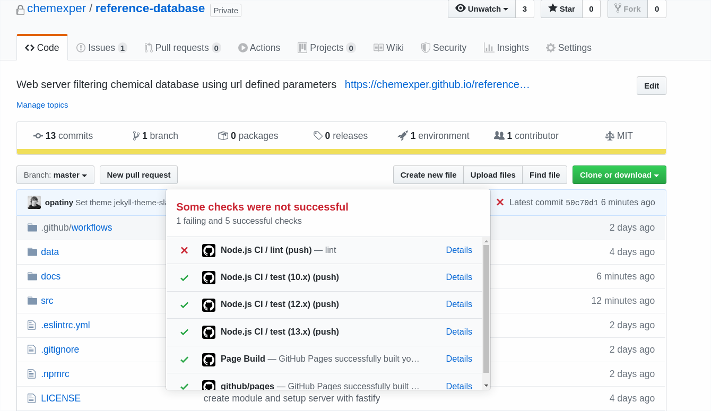

## GitHub cheatsheet

## Tests failing

You see that tests fail in GitHub when there is a little cross next to the last commit message (see image). By clicking on the cross, you can have all the details of the tests failing.



## Unstage last commit

```bash
git reset HEAD~1 # ~1 means you want to unstage only the last commit
```

## URL to specific lines in a commit

It is possible to get a unique URL that links to some lines of a commit by installing the **GitHub Linker** plugin.
Once installed, highlight some lines, R+Click -> *Github Linker: Copy link to selection*.
Then, you can for example open an issue and paste the link in it. Once you commit your local change, the link will show you the exact highlighted lines.

## URL to a file at a certain commit

When browsing in files in GitHub, you can press **y** and the url of the page will change into a unique URL that will always lead to that exact version of the file.

## Where to put the JS-docs in GitHub

Use the [cheminfo-tools](../js/npmDevPackages) package to generate the docs.

In GitHub, go to the project Settings -> Options -> GitHub Pages and set the "Source" to "master branch /docs folder".

Copy the GitHub Pages link, go back to the project main page and paste it next to the project description.
